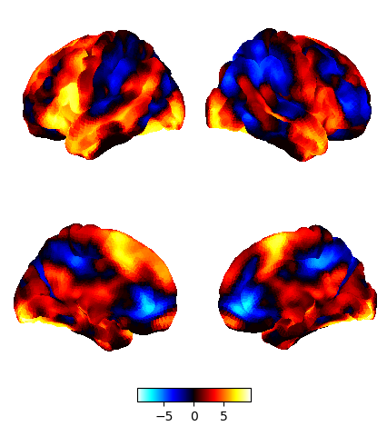
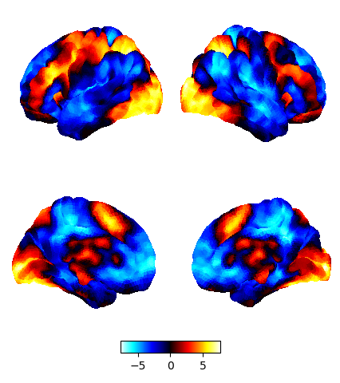
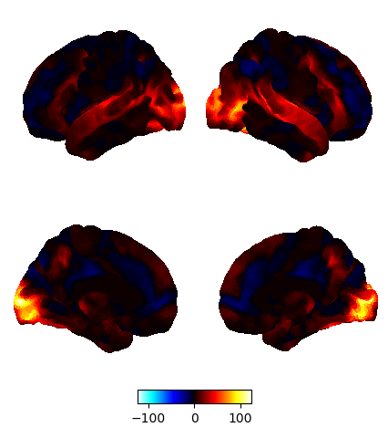

| Task name | Paper of origin | Surface map |
|---|---|---|
| Self Task  | https://www.sciencedirect.com/science/article/pii/S1053810021000659 |  |
| Other Task  | https://www.sciencedirect.com/science/article/pii/S1053810021000659 |  |
| Go-NoGo Task | https://www.sciencedirect.com/science/article/pii/S1053810021000659 |  |
| Finger Tapping Task | https://pubmed.ncbi.nlm.nih.gov/16934301/ |  |
| Reading Task | https://elifesciences.org/articles/74011 |  |
| Memory Task | https://elifesciences.org/articles/74011 |  |
| Zero-Back Task | https://www.nature.com/articles/s41467-019-11764-y |  |
| One-Back Task | https://www.nature.com/articles/s41467-019-11764-y |  |
| Easy Math Task | https://www.sciencedirect.com/science/article/pii/S1053811920305607 |  |
| Hard Math Task | https://www.sciencedirect.com/science/article/pii/S1053811920305607 |  |
| Movie Task Bridgerton | https://www.sciencedirect.com/science/article/pii/S1053810021000659 |  |
| Movie Task Inception | https://www.sciencedirect.com/science/article/pii/S1053810021000659  |  |
| Two-Back Task Faces | https://www.ncbi.nlm.nih.gov/pmc/articles/PMC4011498/ |  |
| Two-Back Task Places | https://www.ncbi.nlm.nih.gov/pmc/articles/PMC4011498/ |  |
