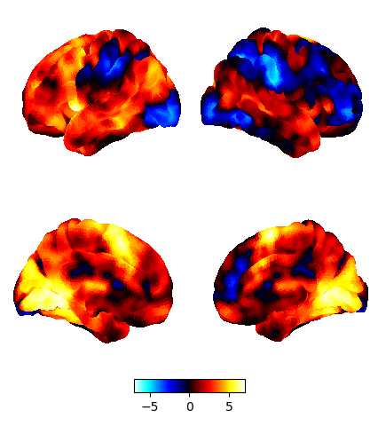
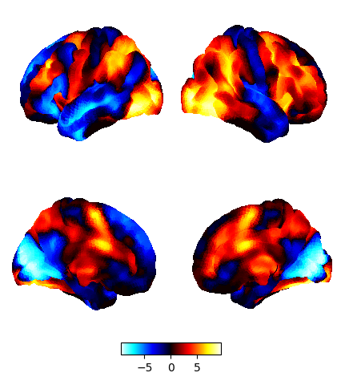
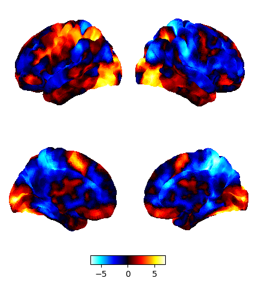

| Task name | Paper of origin | Map Description |Surface map |
|---|---|---|---|
| Self Task  | Konu, D., Mckeown, B., Turnbull, A., Ho, N. S. P., Karapanagiotidis, T., Vanderwal, T., McCall, C., Tipper, S. P., Jefferies, E., & Smallwood, J. (2021). Exploring patterns of ongoing thought under naturalistic and conventional task-based conditions. Consciousness and cognition, 93, 103139. |  | |
| Other Task  | Konu, D., Mckeown, B., Turnbull, A., Ho, N. S. P., Karapanagiotidis, T., Vanderwal, T., McCall, C., Tipper, S. P., Jefferies, E., & Smallwood, J. (2021). Exploring patterns of ongoing thought under naturalistic and conventional task-based conditions. Consciousness and cognition, 93, 103139. |  |  |
| Go-NoGo Task | Konu, D., Mckeown, B., Turnbull, A., Ho, N. S. P., Karapanagiotidis, T., Vanderwal, T., McCall, C., Tipper, S. P., Jefferies, E., & Smallwood, J. (2021). Exploring patterns of ongoing thought under naturalistic and conventional task-based conditions. Consciousness and cognition, 93, 103139. |  |  |
| Finger Tapping Task | Livesey, A. C., Wall, M. B., & Smith, A. T. (2007). Time perception: manipulation of task difficulty dissociates clock functions from other cognitive demands. Neuropsychologia, 45(2), 321-331.  |  |  |
| Reading Task | Zhang, M., Bernhardt, B. C., Wang, X., Varga, D., Krieger-Redwood, K., Royer, J., Rodríguez-Cruces, R., de Wael, R. V., Margulies, D. S., & Smallwood, J. (2022). Perceptual coupling and decoupling of the default mode network during mind-wandering and reading. Elife, 11, e74011.  |  |  |
| Memory Task | Zhang, M., Bernhardt, B. C., Wang, X., Varga, D., Krieger-Redwood, K., Royer, J., Rodríguez-Cruces, R., de Wael, R. V., Margulies, D. S., & Smallwood, J. (2022). Perceptual coupling and decoupling of the default mode network during mind-wandering and reading. Elife, 11, e74011.  |  |  |
| Zero-Back Task | Turnbull, A., Wang, H., Murphy, C., Ho, N., Wang, X., Sormaz, M., Karapanagiotidis, T., Leech, R., Bernhardt, B., & Margulies, D. (2019). Left dorsolateral prefrontal cortex supports context-dependent prioritisation of off-task thought. Nature communications, 10(1), 3816.  |  |  |
| One-Back Task | Turnbull, A., Wang, H., Murphy, C., Ho, N., Wang, X., Sormaz, M., Karapanagiotidis, T., Leech, R., Bernhardt, B., & Margulies, D. (2019). Left dorsolateral prefrontal cortex supports context-dependent prioritisation of off-task thought. Nature communications, 10(1), 3816.  |  |  |
| Easy Math Task | Wang, X., Margulies, D. S., Smallwood, J., & Jefferies, E. (2020). A gradient from long-term memory to novel cognition: Transitions through default mode and executive cortex. NeuroImage, 220, 117074.  |  |  |
| Hard Math Task | Wang, X., Margulies, D. S., Smallwood, J., & Jefferies, E. (2020). A gradient from long-term memory to novel cognition: Transitions through default mode and executive cortex. NeuroImage, 220, 117074.  |  |  |
| Movie Task Bridgerton | Konu, D., Mckeown, B., Turnbull, A., Ho, N. S. P., Karapanagiotidis, T., Vanderwal, T., McCall, C., Tipper, S. P., Jefferies, E., & Smallwood, J. (2021). Exploring patterns of ongoing thought under naturalistic and conventional task-based conditions. Consciousness and cognition, 93, 103139. |  |  |
| Movie Task Inception | Konu, D., Mckeown, B., Turnbull, A., Ho, N. S. P., Karapanagiotidis, T., Vanderwal, T., McCall, C., Tipper, S. P., Jefferies, E., & Smallwood, J. (2021). Exploring patterns of ongoing thought under naturalistic and conventional task-based conditions. Consciousness and cognition, 93, 103139.  |  |  |
| Two-Back Task Faces | Barch, D. M., Burgess, G. C., Harms, M. P., Petersen, S. E., Schlaggar, B. L., Corbetta, M., Glasser, M. F., Curtiss, S., Dixit, S., & Feldt, C. (2013). Function in the human connectome: task-fMRI and individual differences in behavior. NeuroImage, 80, 169-189.  |  |  |
| Two-Back Task Places | Barch, D. M., Burgess, G. C., Harms, M. P., Petersen, S. E., Schlaggar, B. L., Corbetta, M., Glasser, M. F., Curtiss, S., Dixit, S., & Feldt, C. (2013). Function in the human connectome: task-fMRI and individual differences in behavior. NeuroImage, 80, 169-189.  |  |  |
